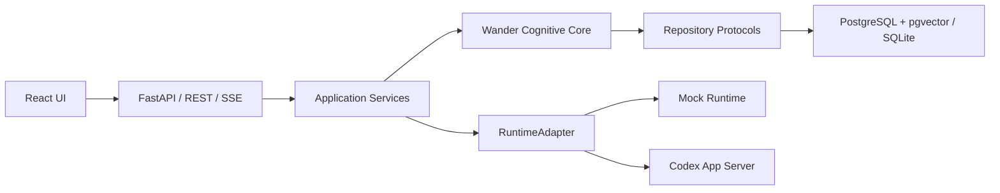

# WanderMind

> Can a machine wander—and discover wonders?

WanderMind 是一个**可控、可解释、可评估**的认知漫游引擎。它把用户的零散知识、问题和半成品想法组织成知识场，通过语义检索、跨域碰撞、六类认知算子、分层评分和独立批评，选择性地呈现值得继续思考的 Wonder。

它不是聊天机器人，也不以“持续输出”为目标。低质量结果会被保留为可审计 Candidate，但不会打扰用户。

## 当前能力

- Knowledge / Seed / Candidate / Wonder / Session / Trace / Feedback 完整领域模型。
- 规范化、摘要、主题与实体提取、确定性向量、精确与语义去重。
- 词法锚点 + 向量距离检索、距离分带、多维 Knowledge Patch 与多归属关系。
- Idea Graph 边管理，以及邻居、血缘、证据和矛盾关系查询。
- Analogy、Conceptual Blend、Counterfactual、Inversion、Abstraction、Second-order 共六类算子。
- 显式状态机、时间/步数/候选/Runtime 预算、结构化 Trace 与 SSE 回放。
- 多维评分、冗余/任意性/幻觉风险惩罚、阈值化静默机制。
- 可替换 RuntimeAdapter；Mock/Codex App Server 适配器及会话、耗时、调用成本持久化。
- Explorer / Evidence / Independent Critic 深度评估；无引用时绝不伪造证据。
- APScheduler 孵化、跨时间配对、近期知识 Seed、Re-Wonder 血缘。
- FastAPI + SQLAlchemy + PostgreSQL/pgvector；SQLite 可用于本地与测试。
- React 19 四页 UI：Inbox、Wander、Wonders、Wonder Detail。
- 后端单测/集成测试、前端单测、Playwright E2E、认知基准和 1000×100 压力冒烟。

## 架构



核心包 `backend/src/wandermind/cognitive` 不依赖 FastAPI、ORM 或 Codex。详细边界、状态流转与数据模型见 `docs/architecture.md`；架构决策见 `DECISIONS.md`。

## 环境要求

- Python 3.12+
- Node.js 22.12+（前端锁定 pnpm 11.19）
- Docker Desktop / Docker Engine + Compose（推荐）
- 可选：Codex CLI，用于真实 Runtime；默认 Mock Runtime 无需外部模型

## 一键启动

```powershell
Copy-Item .env.example .env
docker compose up --build
```

打开：

- UI：<http://localhost:8080>
- API 文档：<http://localhost:8000/docs>
- 健康检查：<http://localhost:8000/health>
- Prometheus 指标：<http://localhost:8000/metrics>

Compose 会启动 pgvector/PostgreSQL、执行 Alembic 迁移、启动 API 与 Nginx 前端。

## 线上部署

[当前试用实例](https://wandermind-p6jg.onrender.com)（用户名 `wandermind`；密码在 Render Environment 的 `WANDERMIND_ACCESS_PASSWORD` 中）

[](https://render.com/deploy?repo=https://github.com/xxiaoxiong/WanderMind)

仓库根目录的 `Dockerfile` 会构建 React UI，并由同一个 FastAPI 容器提供 UI、API 和迁移；`render.yaml` 会创建 Web Service 与 PostgreSQL 16 数据库。部署完成后：

1. 在 Render 服务的 Environment 页面查看或重置自动生成的 `WANDERMIND_ACCESS_PASSWORD`。
2. 使用用户名 `wandermind` 和该密码访问服务 URL。
3. 打开 `/health` 检查服务；该探针故意不要求认证。

Render 免费 Web Service 会在空闲时休眠，免费 PostgreSQL 数据库会在创建 30 天后到期，因此只适合试用。长期保存个人知识时应切换付费数据库并配置备份。完整步骤见 `docs/deployment.md`。

## 本地开发

### Windows

```powershell
powershell -NoProfile -ExecutionPolicy Bypass -File ./scripts/bootstrap.ps1 `
  -Python "C:\Path\To\Python312\python.exe" -Pnpm pnpm.cmd

# 终端 1
cd backend
./.venv/Scripts/python.exe -m uvicorn wandermind.main:app --reload

# 终端 2
cd frontend
pnpm.cmd dev
```

默认本地数据库是 `backend/wandermind.db`。若使用 PostgreSQL，先设置 `WANDERMIND_DATABASE_URL` 并运行：

```powershell
cd backend
./.venv/Scripts/alembic.exe upgrade head
```

### Linux / macOS

```bash
make install
cd backend && .venv/bin/uvicorn wandermind.main:app --reload
cd frontend && corepack pnpm dev
```

## 可复现 Demo

先启动服务，然后：

```powershell
powershell -NoProfile -ExecutionPolicy Bypass -File ./scripts/demo.ps1
```

脚本导入 `data/demo_knowledge.jsonl` 中 120 条、12 个领域的公开合成知识，创建 Seed，运行 Wander，并输出 Wonder Detail 链接。也可使用 API 文档逐步执行导入、Seed、Wander 和 Feedback。

## API

| Method | Path | Purpose |
|---|---|---|
| POST / GET | `/api/v1/knowledge` | 导入、列出知识 |
| POST | `/api/v1/knowledge/document` | 上传 UTF-8 文本 |
| GET | `/api/v1/knowledge/search?q=...` | 搜索知识 |
| DELETE | `/api/v1/knowledge/{id}` | 删除知识及关联图边 |
| POST / DELETE | `/api/v1/graph/edges` | 创建图边 / 按 ID 删除图边 |
| GET | `/api/v1/graph/{id}/neighbors` | 查询邻居，可按关系类型过滤 |
| GET | `/api/v1/graph/{id}/lineage` | 查询 Idea 血缘 |
| GET | `/api/v1/graph/{id}/evidence` | 查询支持与反证 |
| GET | `/api/v1/graph/{id}/contradictions` | 查询矛盾关系 |
| POST / GET | `/api/v1/seeds` | 创建、列出 Seed |
| POST | `/api/v1/wander` | 执行预算化漫游 |
| GET | `/api/v1/wander/{id}/stream` | SSE 结构化 Trace |
| POST | `/api/v1/wander/{id}/stop` | 停止运行中 Session |
| DELETE | `/api/v1/wander/{id}` | 级联删除 Session 产物并解绑 Runtime 会话 |
| GET | `/api/v1/wonders` | 获取已呈现 Wonders |
| POST | `/api/v1/wonders/{id}/explore` | Explorer/Evidence/Critic 深探 |
| POST | `/api/v1/wonders/{id}/feedback` | 保存、继续、否定等反馈 |
| DELETE | `/api/v1/wonders/{id}/feedback/{feedback_id}` | 删除反馈 |
| POST | `/api/v1/wonders/{id}/rewonder` | 用新知识生成后继 Wonder |
| DELETE | `/api/v1/wonders/{id}` | 删除 Wonder 及其反馈 |
| POST | `/api/v1/incubation/run` | 手动触发静默孵化 |

错误统一为 `{"error":{"code","message","details","retryable"}}`。OpenAPI 是接口契约的最终权威。

## 配置

复制 `.env.example`。常用配置：

- `WANDERMIND_DATABASE_URL`：SQLAlchemy async URL。
- `WANDERMIND_ACCESS_USERNAME` / `WANDERMIND_ACCESS_PASSWORD`：可选全站 Basic Auth；公网部署必须设置强密码。
- `WANDERMIND_STATIC_DIR`：由后端托管前端构建产物的目录，通常仅由统一部署镜像设置。
- `WANDERMIND_RUNTIME_ADAPTER=mock|codex`：Runtime 实现。
- `WANDERMIND_CODEX_EXECUTABLE` / `WANDERMIND_RUNTIME_CWD`：Codex App Server。
- `WANDERMIND_WONDER_THRESHOLD`：呈现阈值。
- `WANDERMIND_ENABLE_SCHEDULER`：后台孵化。
- `WANDERMIND_MAX_REQUEST_BYTES`：API 请求上限。

完整说明与安全边界见 `docs/configuration.md`。

## 测试

```powershell
powershell -NoProfile -ExecutionPolicy Bypass -File ./scripts/test.ps1
```

或分别运行：

```powershell
cd backend
./.venv/Scripts/python.exe -m ruff format --check .
./.venv/Scripts/python.exe -m ruff check .
./.venv/Scripts/python.exe -m mypy src tests
./.venv/Scripts/python.exe -m pytest -q

cd ../frontend
pnpm.cmd lint
pnpm.cmd test:coverage
pnpm.cmd build
pnpm.cmd test:e2e
```

后端覆盖率门为 75%，Mypy 使用 strict。CI 同时校验容器构建、秘密扫描和认知回归。最终验证记录见 `TEST_REPORTS.md` 与 `docs/release/v0.1_test_report.md`。

## 评估

```powershell
cd backend
./.venv/Scripts/python.exe scripts/run_benchmark.py
./.venv/Scripts/python.exe scripts/performance_smoke.py --knowledge 1000 --sessions 100
```

基准包含 interesting / obvious / nonsense / duplicate 四类已知连接，任何 Prompt、Operator、Embedding、Retrieval、Score 或 Critic 变更都应重跑。结果与解释见 `docs/evaluation/evaluation_report_v0.1.md`。

## Codex Runtime

`WANDERMIND_RUNTIME_ADAPTER=codex` 时，后端启动 `codex app-server --stdio`，使用当前 JSON-RPC 方法管理 thread/turn，并对返回 JSON Schema 做二次验证。所有认知任务默认 `read-only`、禁止网络、`approvalPolicy=never`；写工作区必须显式改代码策略。

当前官方 Codex SDK 重点支持 TypeScript；本项目是 Python 后端，因此采用官方文档提供的 App Server 协议作为语言无关集成边界。参见 [Codex SDK](https://developers.openai.com/codex/sdk/) 与 [Codex App Server](https://developers.openai.com/codex/app-server/)。

## 运维与排错

- `/health` 失败：检查数据库连接和 Compose healthcheck。
- Alembic 失败：确认 pgvector 镜像已就绪，运行 `alembic upgrade head`。
- Codex Runtime 不可用：先保持 `mock` 验证系统，再确认 `codex app-server --help`。
- 前端 API 失败：本地 Vite 代理指向 `localhost:8000`；容器内由 Nginx 代理。
- 上传被拒绝：仅支持 UTF-8 文本，Nginx 与 API 均限制约 2 MB。

备份、恢复、指标和事故处理见 `docs/operations.md`。当前限制见 `docs/known-limitations.md`。

## 目录

```text
backend/        Python 领域、认知、应用、Runtime、API、迁移与测试
frontend/       React/Vite UI、Vitest 与 Playwright
data/           Demo、已知连接、回归阈值、人工评估模板
docs/           原始需求、设计、架构、配置、部署、评估、发布报告
scripts/        安装、测试、Demo 与秘密扫描
reports/        本地 benchmark / performance 输出
```
