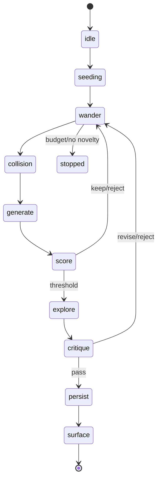
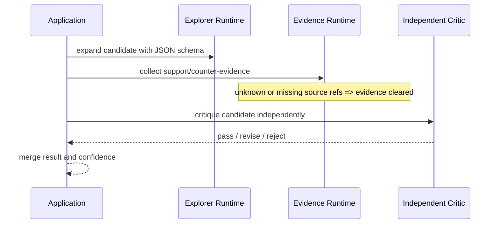

# WanderMind V0.1 架构

## 设计目标

1. Cognitive Core 可脱离 Web、数据库和 Runtime 独立测试。
2. 每次漫游有明确状态、预算、路径、候选、评分和停止原因。
3. Runtime 可替换、可恢复、可中断、默认只读。
4. “没有好结果”是合法输出，不能用低质量内容填充界面。
5. 每个架构变化都能通过自动测试和认知回归验证。

## 分层边界

| 层 | 目录 | 责任 | 禁止依赖 |
|---|---|---|---|
| Domain | `models` | 实体、枚举、不变量 | FastAPI、SQLAlchemy、Codex |
| Cognitive | `cognitive` | 检索、Patch、算子、状态机、评分、Engine | FastAPI、具体 ORM |
| Application | `application` | 深探、反馈、孵化、依赖装配 | 路由细节 |
| Runtime | `runtime` | 会话生命周期、重试、中断、结构化输出 | 业务仓储实现 |
| Repository | `repositories` | Protocol 与 Memory/SQL 实现 | API |
| Infrastructure | `infrastructure` | 配置、ORM、数据库、日志、安全 | UI |
| API | `api` | REST/SSE、校验、错误契约 | 认知实现细节 |

## Wander 状态机

`CognitiveStateMachine` 拒绝非法跳转；`WanderSession` 要求 terminal 状态必须存在 `ended_at`。预算同时限制 steps、patch switches、candidates、runtime calls 与 elapsed time。

## 认知流水线

1. Seed：显式输入；没有 Pending Seed 时可从最新知识创建 Recent Seed。
2. Patch：同时按 domain、project、topic、temporal 与确定性 embedding cluster 建立多维分区；Item 可属于多个 Patch，用质心距离 O(n·d) 估算一致性。
3. Retrieval：词法标题锚点与语义距离共同排序，再按分位点切分 near / moderate / remote / very-remote。
4. Movement：在相关性下限内做局部移动和受控远跳。
5. Collision：记录结构强度、共享词和语义距离。
6. Operator：依据距离、类型和近期算子历史选择六类结构化算子。
7. Score：正向维度减去 redundancy / arbitrariness / hallucination risk。
8. Threshold：reject、keep candidate、deep explore 或 surface。
9. Persist：所有 Candidate 和 Trace 可审计；只呈现高于门槛且风险可接受的 Wonder。

## 深度评估

Explorer、Evidence、Critic 使用独立 Runtime Session，并在成功或失败后关闭。候选为中文时 Runtime 输出中文可读字段。Evidence 引用必须来自输入 Context 的精确 `source_ref` 白名单；缺少或出现未知引用时会清空支持/反证文本并提高不确定性。Critic 失败默认 reject。

## 数据与持久化

核心表：

- `knowledge_items`：正文、摘要、主题、实体、向量、来源、置信度。
- `knowledge_edges`：关系类型、权重、置信度、创建来源。
- `seeds`：来源、优先级、状态、最近使用时间。
- `wander_sessions` / `wander_steps`：状态、预算、Trace 与停止原因。
- `candidates`：算子输出、评分解释、筛选状态。
- `wonders`：最终陈述、证据、问题、血缘与用户状态。
- `feedback`：interesting/save/continue/obvious/random/wrong。
- `runtime_sessions`：记录 Provider、用途、外部会话 ID、关联 Wander、生命周期、耗时与调用成本。

Idea Graph 通过 Application Service 校验端点存在性，并提供邻居、血缘、证据/反证与矛盾查询；删除 Knowledge 时同步清理相连边。

PostgreSQL 使用 pgvector；SQLite 自动退化为 JSON 向量，便于测试。Repository Protocol 保证核心不依赖具体数据库。

## API 与流式策略

`POST /wander` 在当前进程内完成一次短预算运行并返回完整结果；`GET /wander/{id}/stream` 以 SSE 回放结构化 Trace。这保证 V0.1 的确定性与断线重放，但不是逐 token 推理流。长期运行应迁移到持久化队列和实时事件总线，见限制文档。

## 安全不变量

- 文本长度、控制字符和异常重复字符在边界校验。
- Nginx 与 API 双层请求大小限制。
- Runtime 默认 read-only、network disabled、never approval。
- Runtime JSON 先由协议 Schema 约束，再由本地 JSON Schema 与 Pydantic 验证。
- OpenAI-compatible API key 仅保存在 SecretStr 与请求 Authorization header，不进入 metadata、usage 或日志。
- 日志不输出知识正文；结构化请求日志含 request id。
- Evidence 不得在缺少引用时生成“看似有来源”的文本。

## 可观测性

- JSON 日志：请求 ID、方法、路径、状态、耗时。
- Prometheus：请求计数/耗时、Wander 耗时/步数/Patch 切换/Candidate/Wonder/分数、Runtime 调用结果。
- Trace：认知状态、动作、理由、item IDs、operator、distance、novelty、collision。
- Benchmark：每个 case 保存 session、path、patches、candidates、scores、wonders。
